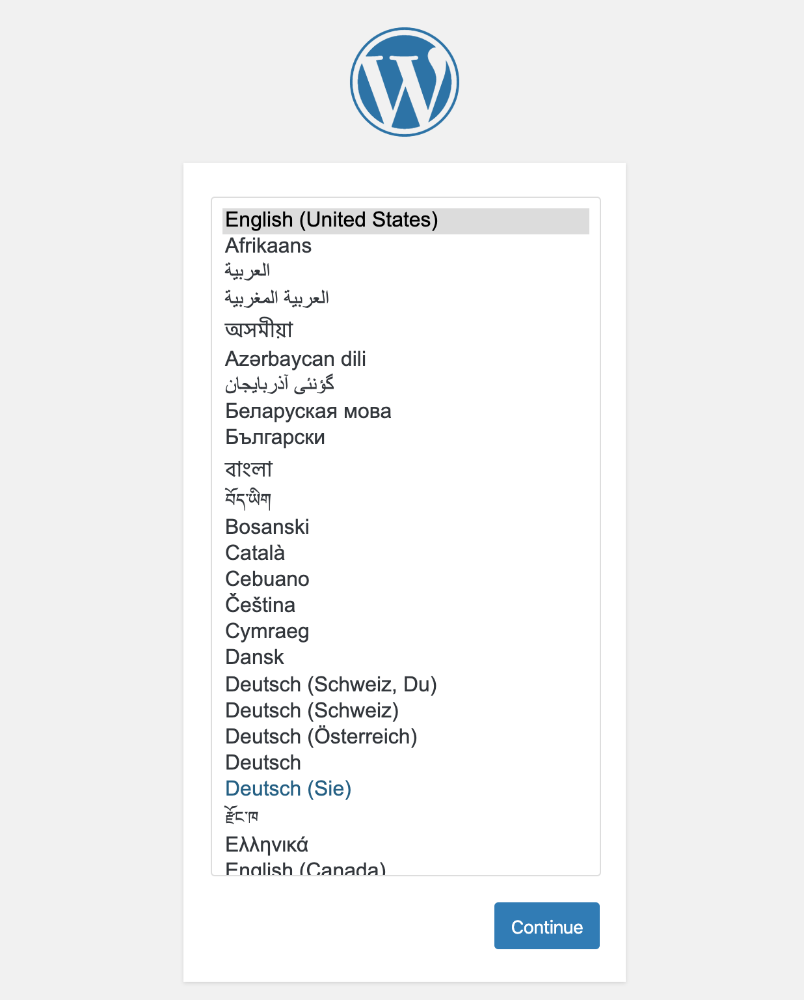
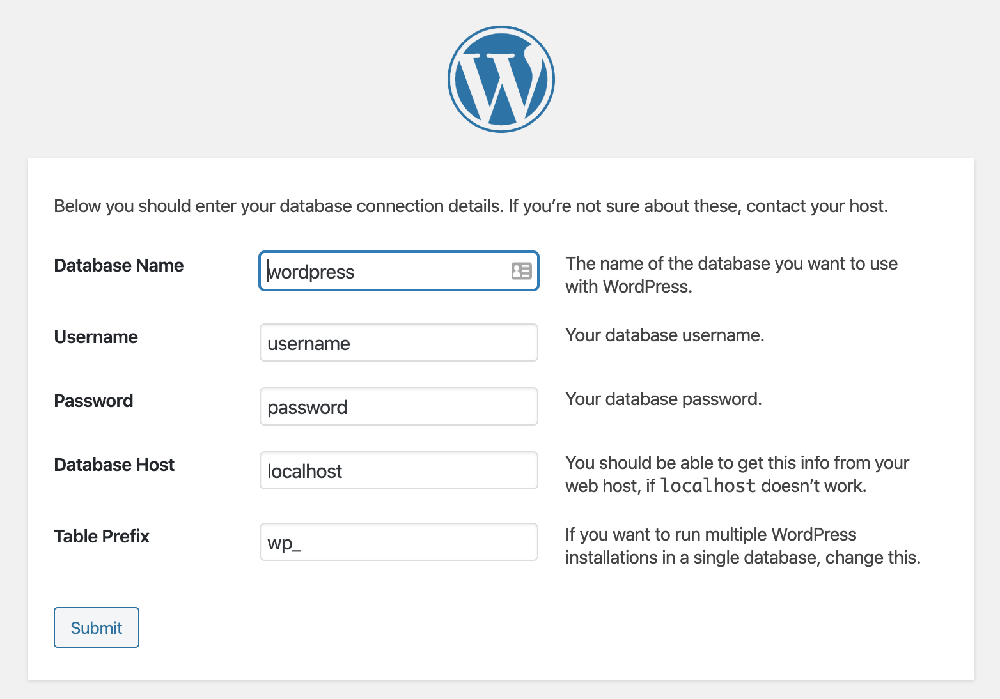

# Easy install WordPress on AWS

Use EC2 and RDS services install WordPress on AWS.

## Service

- EC2
- RDS

## Requirements

- VPC with Internet Gateway

## Install

### Step.1: Launch EC2 instance

- Select `Amazon Linux family` images.
  - Amazon Linux
  - Amazon Linux 2
- Enable `Public IP` for EC2.
- UserData insert `ec2-install.sh` content.
- Security Group enable `HTTP/80` inbound.

### Step.2: Launch RDS instance

- Select `MySQL family` databases.
  - Amazon Aurora
  - MySQL
  - MariaDB
- Security Group enable `MySQL/3306` inbound trust EC2 Security Group Id.
- **Keep your setting data.**
  - Master username and password
  - Database name
  - RDS Endpoint (display after completed.)

### Step.3: Initial WordPress Setup

Sign in EC2 Public IP

- Select your language.

- Database setting

  - Database Name: RDS initial database name.
  - Username: RDS Master user name.
  - Password: RDS Master password.
  - Database Host: RDS endpoint.
  - Table Prefix: default value.

### Welcome WordPress 

WordPress is setup completed. your can signin EC2 `Public IP` on browser.